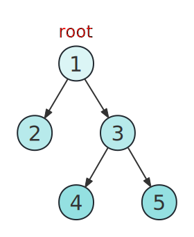

# LeetCode Debugger

力扣题目C++本地调试库

**开发中...敬请期待**

## 1. vector

#### 1.1 从文本构造vector

##### (1) `build_vector<T>`

构造一个vector。参数data为力扣测试用例列表，如 `"[1,2,3,4]"`。

~~~cpp
vector<T> build_vector(string data);
~~~

示例

~~~cpp
vector<int> vec1 = build_vector<int>("[1,2,3,4]");
// 二维vector同理
auto vec2 = build_vector<vector<int>>("[[1,2],[3,4],[5]]");
~~~

模板 `T` 支持的数据类型如下表

|一维|二维|三维|
|:-:|:-:|:-:|
|`int`|`vector<int>`|`vector<vector<int>>`|
|`unsigned`|`vector<unsigned>`|❌|
|`long long`|`vector<long long>`|❌|
|`unsigned long long`|`vector<unsigned long long>`|❌|
|`float`|`vector<float>`|❌|
|`double`|`vector<double>`|❌|
|`string`|`vector<string>`|❌|
|`char`|`vector<char>`|`vector<vector<char>>`|

##### (2) `""_vector..`（不推荐）

~~~cpp
vector<int> operator""_vector_int(const char* arg, size_t n);
vector<long long> operator""_vector_long_long(const char* arg, size_t n);
vector<float> operator""_vector_float(const char* arg, size_t n);
vector<double> operator""_vector_double(const char* arg, size_t n);
vector<string> operator""_vector_string(const char* arg, size_t n);
vector<char> operator""_vector_char(const char* arg, size_t n);
~~~

示例

~~~cpp
auto vi = "[1,2,3,4]"_vector_int;
auto vl = "[1,2]"_vector_long_long;
auto vf = "[3.14,2.71,1.41,0.5]"_vector_float;
auto vd = "[3.1415926,2.71828]"_vector_double;
auto vs = R"(["akashi","neko"])"_vector_string;
auto vc = R"(["a","b","c","d"])"_vector_char;
~~~

#### 1.2 查看vector

##### (1) `show_vector<T>`

~~~cpp
void show_vector(vector<T>& vec, bool newLine = true);
~~~

查看一个vector中的所有元素。参数vec为要查看的vector，参数newLine表示打印后是否换行，默认为换行。

示例

~~~cpp
vector<int> vi = {1, 2, 3};
show_vector(vi);
vector<string> vs = {"akashi", "neko"};
show_vector(vs);
~~~

输出

~~~
1 2 3
[0]: "akashi"
[1]: "neko"
~~~

##### (2) `cout <<` 输出

~~~cpp
ostream& operator<<(ostream& cout, vector<T> vec);
~~~

示例

~~~cpp
vector<int> vec = {1, 2, 3};
cout << vec << endl;
~~~

输出

~~~
1 2 3
~~~

## 2. Tree

#### 2.1 构造二叉树（反序列化二叉树）

##### (1) `buildTree`

力扣使用带 `null` 的**层序遍历**序列化二叉树，同时删去层序遍历结果末尾的所有 `null` 。比如序列`"[1,2,3,null,null,4,5]"`表示的二叉树如下图所示。

~~~cpp
TreeNode* buildTree(string data);
~~~

从力扣列表反序列化二叉树。参数data为力扣的二叉树列表。

##### (2) `""_tree`

~~~cpp
TreeNode* operator""_tree(const char* arg, size_t n);
~~~

示例

~~~cpp
TreeNode* root = "[1,2,3,null,null,4,5]"_tree;
~~~

#### 2.2 查看二叉树（序列化二叉树）

##### (1) `treeToString`

将二叉树序列化为Leetcode字符串。参数root为二叉树的根节点。

~~~cpp
string treeToString(TreeNode* root);
~~~

示例

~~~cpp
auto root = "[1,2,3,null,null,4,5]"_tree;
string str = treeToString(root)
~~~

输出

~~~cpp
[1,2,3,null,null,4,5]
~~~

##### (2) `cout << ` 二叉树

~~~cpp
ostream& operator<<(ostream& cout, TreeNode* root);
~~~

示例

~~~cpp
auto root = "[1,2,3,null,null,4,5]"_tree;
cout << root << endl;
~~~

输出

~~~cpp
[1,2,3,null,null,4,5]
~~~

未完待续...